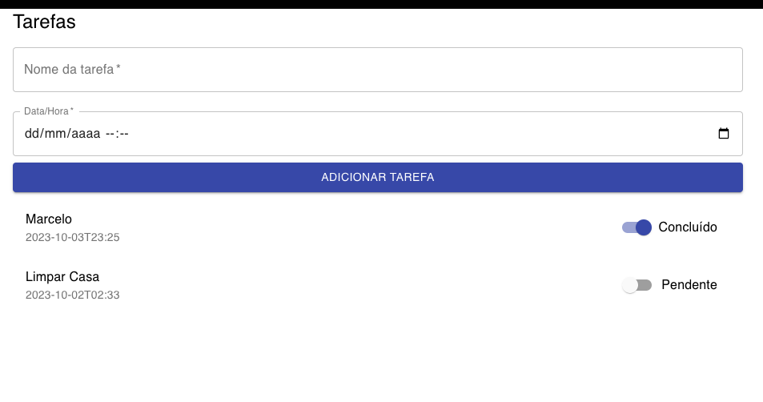
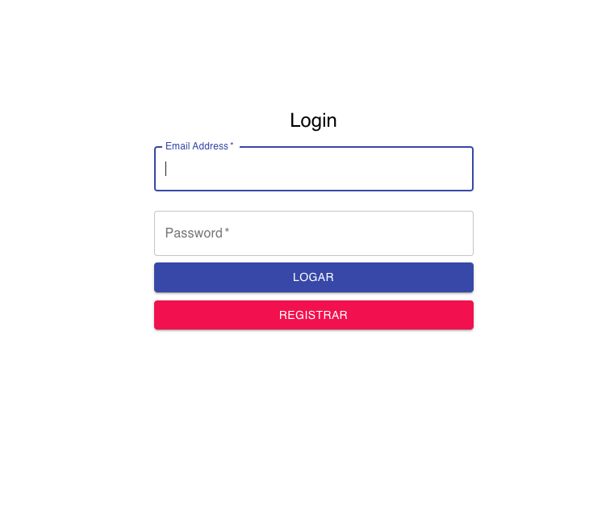
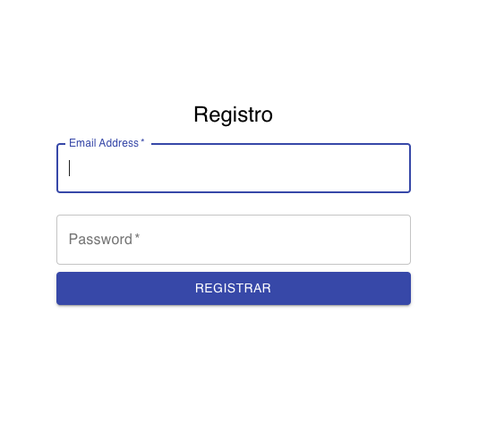

npm i
npm start

Projeto pós graduação
Caro (a), Marcelo, desenvolva um aplicativo móvel utilizando a tecnologia React JS e Google Firebase. Utilize todos os conceitos abordados desde o início, desde o design sprint, design thinking e todos os demais para criar o produto correto para solucionar o problema de gestão de horários de um usuário. O aplicativo precisa ser simples, e permitir que o usuário adicione suas tarefas do dia. A seguir um descritivo melhor:

Descritivo:

Tela de login;
Tela de cadastro;
Tela home;
O usuário deverá poder adicionar pela home tarefas diárias com o horário da execução da mesma, título e o status de concluída ou não. Na tela de dashboard o usuário deverá conseguir ver um levantamento de todas as tasks do dia feitas.

